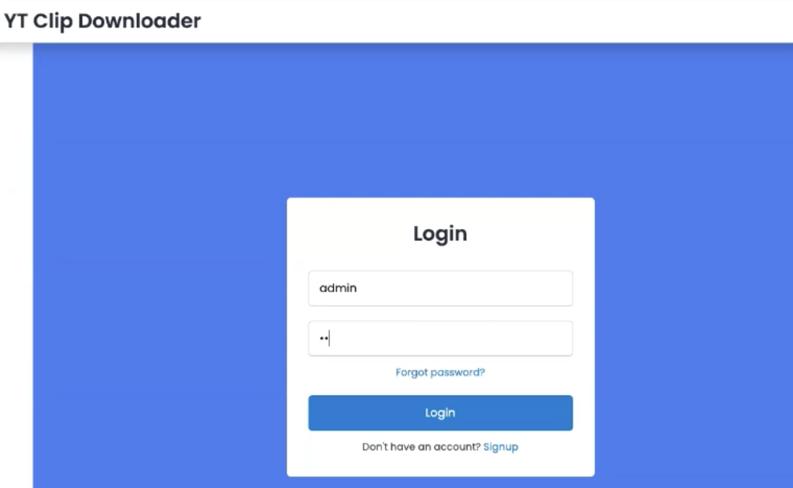
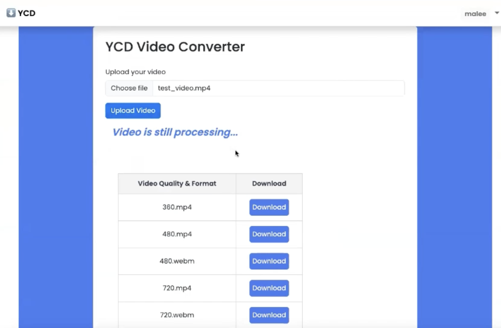
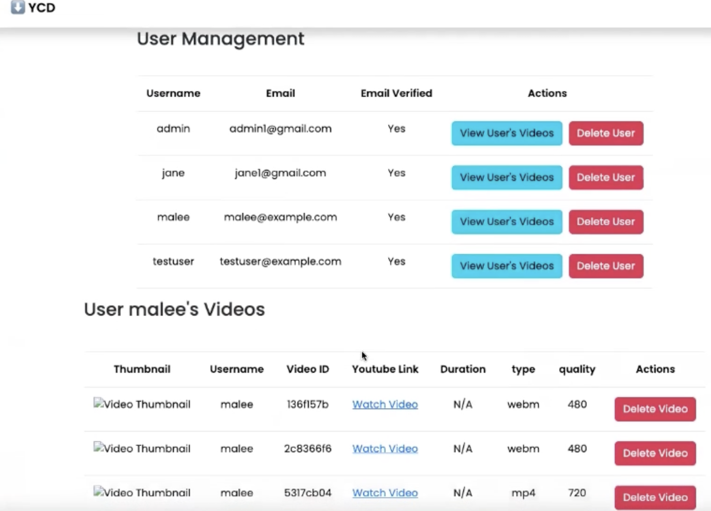

#Video Transcoding WebApp using AWS

##Overview
The application transcodes a video uploaded by a user who registers and logins to the
application successfully. Video can be transcoded to the required format such as 720 mp4, 720 webm and so on. Admin can view and delete user's data and user's videos

##App Architecture

###Archiecture Overview
- I used a choreography approach in this architecture, because it is suitable for its workflow and complexity.
- I decided to have 2 microservices: User service and Video service to respond to core business functions.
- **User Service:** handles public facing, user management, user authentication and user video uploading to S3.
- **Video Service:** focuses only on CPU intensive tasks which is video transcoding process.
- **S3:** stores user uploaded and transcoded video files.
- **DynamoDB:** records user meta data from Cognito, video meta data from S3 and
presigned-url as a download link after transcoding process is done by video-service.
- **Cognito:** manages, validates and authenticates user.
- **SQS:** send messages from user-service to video-service after user clicks download
button. Video-service receives messages and processes transcoded video then deletes
messages after the task is done. 
- **Parameter store:** stores parameters.
- **DNS:** generates domain name.
- **App Load Balancer:** listens on port https: 443 and then sends requests to target group.
- **Target Group** listen on port: 300 which is user-service.

##Features
- **2 Microservices**
- **Asynchronous processing**
- **Dockerized services**
- **Cloud‑ready architecture**

##Tech Stack
- **Frontend:** HTML, CSS, React, Javascript 
- **Backend:** Node.js
- **Container:** Docker
- **AWS:** ECS, ECR, S3, SQS, ALB, Dynamo DB, Cognito, Parameter store, DNS, Target Group, API Gateway

##Screenshots

### Login Page

### Upload Page

### Video Library

##Reflection
It is one of the porjects that I am very proud of, because people (esp. beginner) saying it is very hard, some people kind of gave up and asked others to help a lots. 
However, I was spending 7 days to do this thing (AWS part) from midday to midnight relentlessly on my own, and I eventually did it. 
It is pretty incredible for me learning cloud computing and going inside cloud service.
It's good learning, the teaching seemed not hard but the real work on the cloud needs time but I'm happy that I understand things so quickly.
